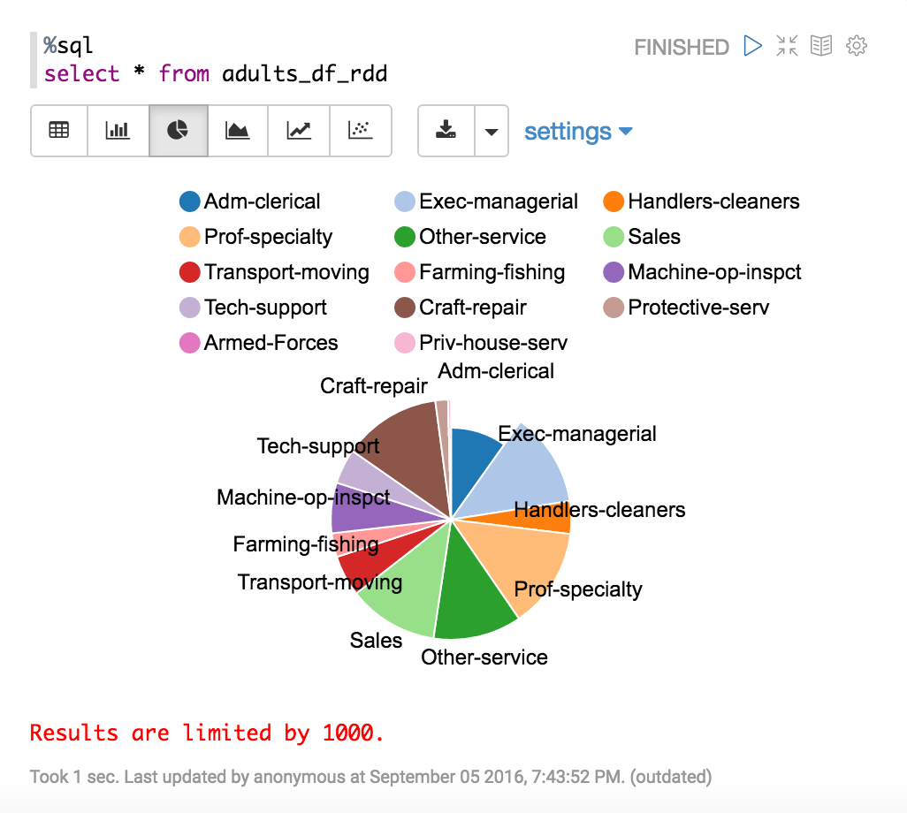

# Import and Load Data
1. Suppose the data path ```/workspace``` was attached to ```/usr/zeppelin_dir``` on host file system.
1. On host machine, move your data to ```/usr/zeppelin_dir```, e.g.
	```
	cp adults.csv /usr/zeppelin_dir
	```
1. Now, we can read the file ```adults.csv``` by using R on Zeppelin. Copy and paste following list to your notebook
	```
	%r
	csvPath <- '/workspace/adults.csv'

	# create a local R data frame
	df_local <- read.table(csvPath, header = FALSE, skip = 1)

	# load this data frame to Spark
	adults_df_rdd <- createDataFrame(sqlContext, df_local)

	printSchema(adults_df_rdd)

	# register a temporary data table for sql query
	registerTempTable(adults_df_rdd, 'adults_df_rdd')
	```

	**Note**: don't miss the ```%r```, specifying the interpreter you want to use.

# Read the R Dataframe from Spark
```
%sql
select * from adults_df_rdd
```
Result


